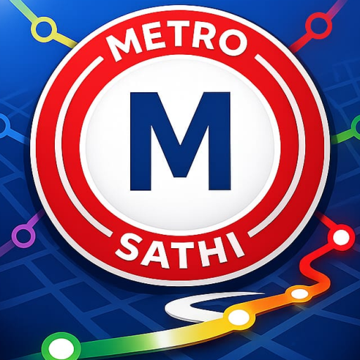
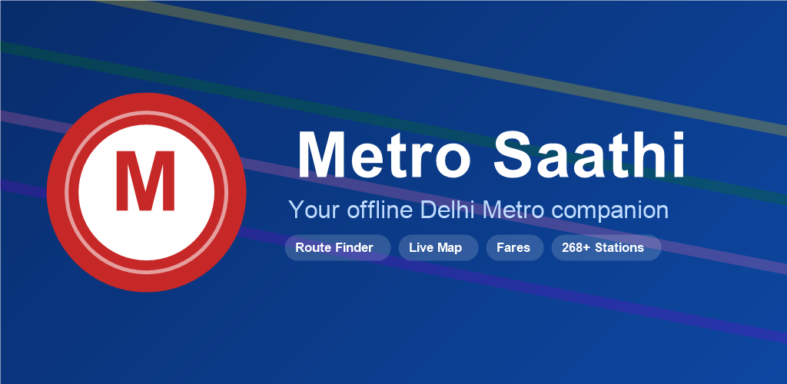
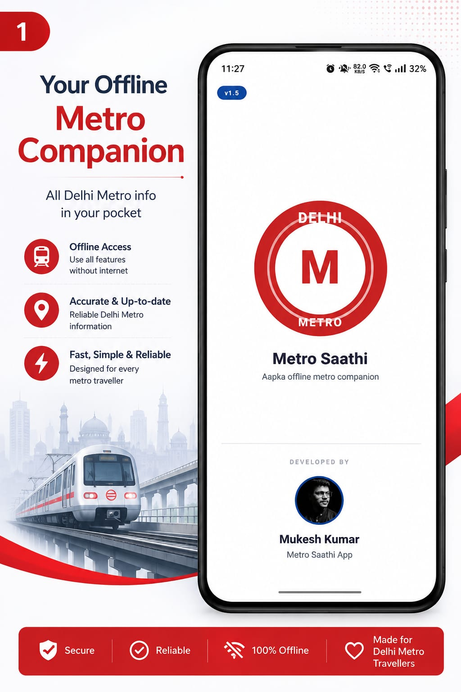
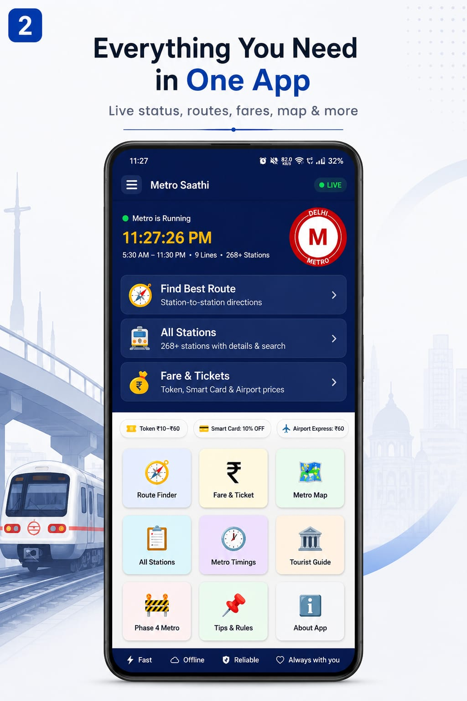
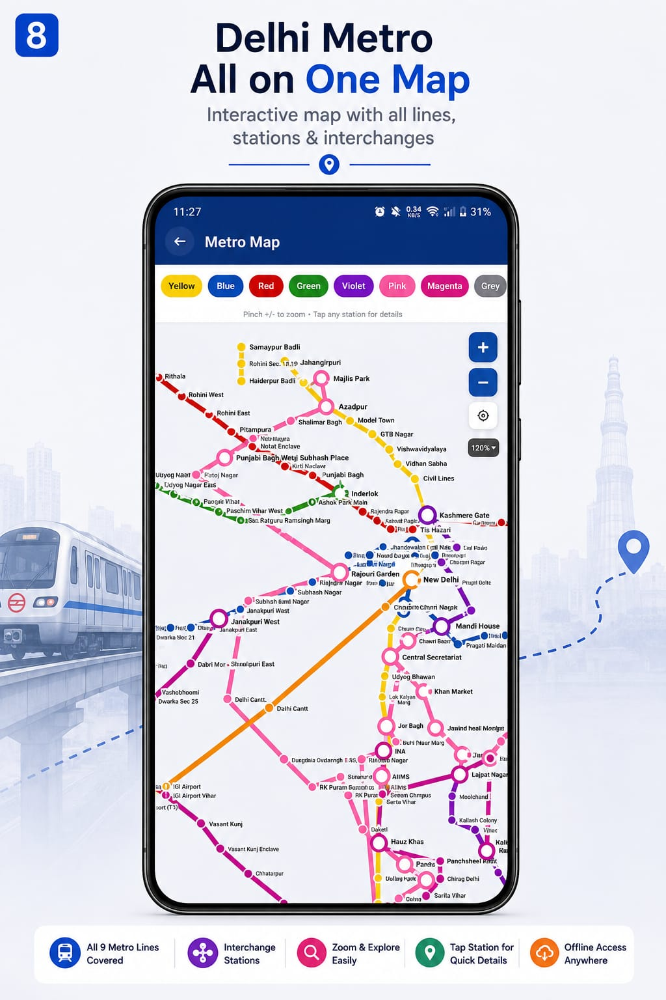

<div align="center">



# Metro Saathi — Delhi NCR Metro Companion

**A fully offline React Native app for Delhi NCR metro commuters — route planning, fares, the full network map, and more, backed by a hand-built offline pathfinding engine.**

[](#)
[](#)
[](#)
[](https://play.google.com/store/apps/details?id=com.delhimetroapp)
[](LICENSE)



</div>

---

## Overview

Metro Saathi is a offline-first React Native app covering the entire Delhi NCR metro network — 268+ real stations across 9 lines plus the Aqua Line (NMRC). Everything works with zero network dependency: route planning, fares, the full map, and station search are all backed by data bundled in the app.

## ✨ Features

- 🧭 **Route Finder** — offline BFS shortest-path search across all 268+ stations, with interchange detection, fare, and time/distance estimates
- 🗺️ **Interactive Metro Map** — pinch-to-zoom map of all 9 lines + the Aqua Line, tap any station for details
- 📋 **268+ station database** — search, filter by line, facility info (lift, ATM, wheelchair access, etc.)
- 💰 **Fare & Tickets** — full fare table by distance slab, Airport Express fares, Tourist Card info
- 🕐 **Metro Timings** — first/last train and peak/off-peak frequency per line
- 🏛️ **Tourist Guide** — 20 Delhi attractions mapped to their nearest metro station
- 🚧 **Phase 4 Metro** — all 6 upcoming corridors, with an optional live news check
- 📌 **Tips & Rules** — ticketing, etiquette, safety, accessibility, emergency helplines

## 📱 Screenshots

<p align="center">
  
  
  
</p>

## 🛠️ Tech Stack

- **Framework:** React Native (TypeScript), single-screen-tree architecture in `App.tsx`
- **Data layer:** `src/data/{lines,stations}.js` — the full DMRC/NMRC network graph, used by an in-app BFS pathfinder for the Route Finder (no external routing API)
- **Native:** Android via Gradle, `arm64-v8a`-only ABI split to keep the sideload APK lightweight
- **Networking:** a single optional read-only fetch (Phase 4 corridor news) — everything else is fully offline

## 🚀 Build it yourself

```bash
git clone https://github.com/mukeshkumar356/metro-saathi.git
cd metro-saathi
npm install
npx react-native run-android   # debug build, no signing needed
```

For a signed release build, copy `android/app/keystore.properties.example` to `keystore.properties` and fill in your own signing details.

## 📄 License

MIT — see [LICENSE](LICENSE).

---

<div align="center">

Built and maintained by **[Mukesh Kumar](https://github.com/mukeshkumar356)**

</div>
